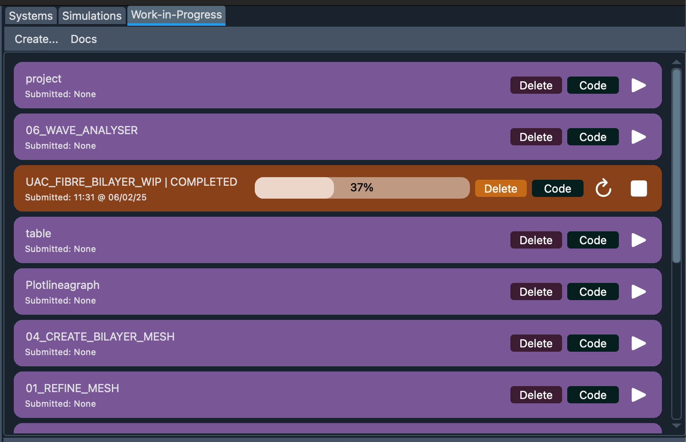
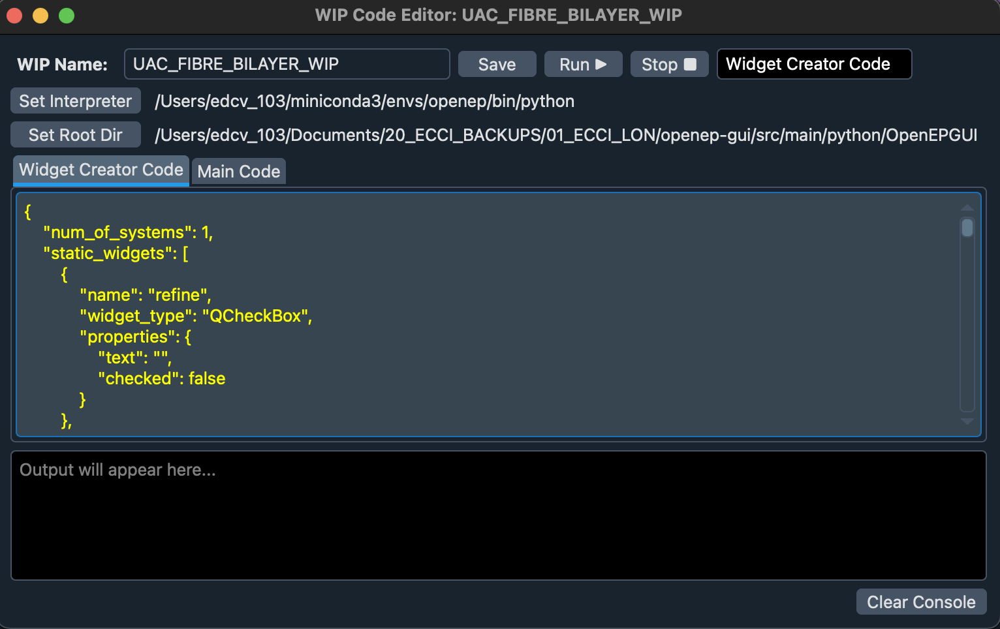

# Bodagh 2025 AF-MRI-EAM Inference Model

Predicts an atrial fibrillation catheter ablation outcome using mean left atrial bipolar voltage, 
magnetic resonance imaging-derived left atrial ejection fraction and patient clinical parameters 
(age, hypertension, weight).

This model is for demonstration only and is not intended for clinical use.

> **NOTE:** This WIP is compatible with EP Workbench's Work-in-Progress Module.

## Pre-requisites

- **EP Workbench** is installed [see guide](https://openep.discourse.group/t/downloading-ep-workbench-beta-for-academic-use/149)
- **Conda** (or your preferred Python environment) is installed.
- **openep-py** python library is installed [repo](https://github.com/ecci-cvs/openep-py).


## How to Install a WIP

1. Ensure all pre-requisites are installed on your computer (see above).

2. Clone this repository:

```bash
git clone <repository-url>
```
   
3. Go to the directory you just cloned and do the following:

```bash
conda create -n wip python=3.9 pip
conda activate wip

which python  # save this env python path for later
pip install -r requirements.txt

```
Your conda environment is now ready!

4. Now open up EP Workbench, and navigate to the tab on the right called `Work-in-Progress` > Click `Create ...`, then press on the `code` button.

5. Fill the WIP Code Editor as follows:

   1. `WIP Name` \<preferred name for this wip\>

   2. `Interpreter` Set the conda environment, this can be found as mentioned above (path to env python)

   3. `Root directory` (For this WIP this is not necessary)

   4. `Widget Creator Code` Copy-paste from widget.json

   5. `Main Code` Copy-paste from inference.py

   6. `Press` SAVE!
   
6. Press on the Widget creator code tab and then press the run button. You can now close this window.





> **NOTE:** Once saved the WIPs settings persist between sessions.


## How to Run the WIP


1. Load the `OpenEP` case in `EP Workbench`.

2. Fill in the user-inputs in the WIP Workspace.

3. Press the Run button.

> **NOTE:** (Optional) See live outputs on the Code > Output Console Window.
---

`Author` Vinush Vigneswaran (vvignesw@ed.ac.uk)

`OpenEP` https://openep.discourse.group/

---

